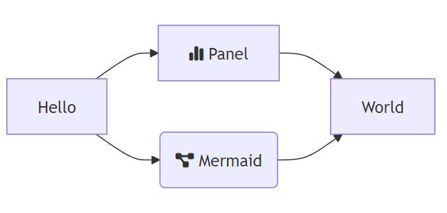
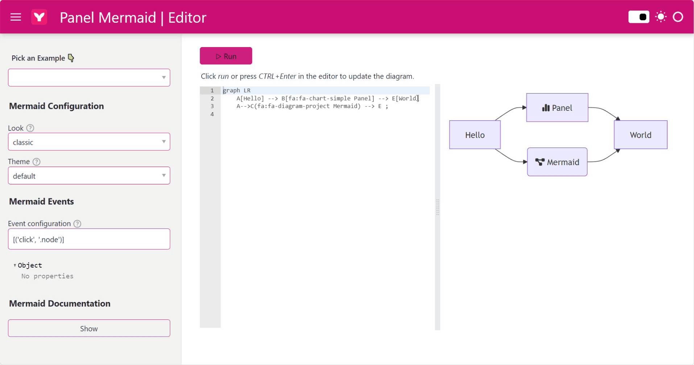

# panel-mermaid

## Overview

`panel-mermaid` is an interactive widget-based tool designed to integrate [Mermaid JS](https://mermaid.js.org/) diagramming functionality with [HoloViz Panel](https://panel.holoviz.org/).

This package provides a seamless interface for creating and customizing Mermaid diagrams directly in Python, with the ability to edit configurations and styles interactively. Works in Jupyter notebooks and in your Panel data app.

[](https://py.cafe/awesome.panel.org/panel-mermaid-diagrams)

### Key Features

- **Interactive Mermaid Diagrams**: Easily create flowcharts, sequence diagrams, class diagrams, and more using the familiar Mermaid syntax.
- **Configurable Themes and Looks**: Choose from a variety of themes (`default`, `dark`, `forest`, etc.) and looks (`classic`, `handDrawn`).
- **Real-time Configuration Updates**: Use the `MermaidConfiguration` widget to dynamically update your diagram’s configuration.
- **Customizable Events**: Handle diagram interactions with event subscriptions (e.g., click, mouseover).
- **Font-Awesome Icon Support**: Leverage Font-Awesome icons in your diagrams by including the Font-Awesome CSS in your application.

## Installation

You can install the package using `pip`:

```bash
pip install panel-mermaid
```

## Usage

### 1. Basic Mermaid Diagram

Here’s how to create a simple Mermaid diagram using the `MermaidDiagram` widget:

```python
import panel as pn

from panel_mermaid import MermaidDiagram

pn.extension()

MermaidDiagram(
    object=(
        """
        graph LR
            A[Hello] --> B[Panel] --> E[World]
            A-->C(Mermaid) --> E ;
        """
    )
).servable()
```

[Try on PY.CAFE](https://py.cafe/snippet/panel/v1#c=H4sIAGrhC2cAA41STU_DMAz9K5FPm9RWMARIRSDxJXEACXGAQzehbPVoUJqE1BtU0_47ztoxBpu25NJnP_vZr5nByOYIKajSWU_CSYNayEo40-c79rZsYq8l-lKqXLTEhwbeKPnmZRm4ziT4RWgqZU2nGyLrnE7fCD52-I4jOm9ROH1Y3B_MZFeI-6dVJJzL7A61tgMRxxfiKnsMQzXgNnuxXueDP3xOXXfaEboNUZxtVuVpu0mFfiqHGsPsEIHHj4nyWKKhiv1ZmND3vGb4iFs3mEe1C_4twgylc88KPyEdS11hBJgrujWhL6TkJxxxNRXWhJLa5irHeHqQ9E6SHhdrWdsJQTqDKfrgI6Q9nsRaerLccrYU84wiGBVK5x6ZlP1kSA4rJE5-qpwKSA-PDyIolXlp4FGD7lC9FawTIC-RwlhpvOKu7MG1NSSVQb9FIVDjYcNlipOhL8B8MI_-T7FlxFUd25W4GtZrV-nfPyGhL1qX2cOG3au3q-xae7nx5j2Ltuvh6fE-msSvRxmpd4kueUE13Hm0sJ_fYzaYfwOdqMshuwMAAA)

### 2. Customizing the Configuration

Use the `MermaidConfiguration` widget to interactively modify the Mermaid diagram configuration. Here's an example of how to integrate it:

```python
import panel as pn

from panel_mermaid import MermaidDiagram, MermaidConfiguration

pn.extension()

configuration = MermaidConfiguration(look="handDrawn", theme="forest")
diagram = MermaidDiagram(
    object=(
        """
        graph LR
            A[Hello] --> B[Panel] --> E[World]
            A-->C(Mermaid) --> E ;
        """
    ),
    configuration={"look": "handDrawn", "theme": "forest"},
)

pn.FlexBox(configuration, diagram).servable()
```

[Try on PY.CAFE](https://py.cafe/snippet/panel/v1#c=H4sIAI_jC2cAA41STY_aMBD9K9acQAoRGwgRqahUdrfaQytVe-geCKoMGYhbx04d8yXEf-84H8tSsWLtQ_LGz2_Gb-YIS50ixCDyQhvLCq5QMl6yQiW0V0bndexXjibnImUN8XsNHwRfG557Lb7XaiXWG8Ot0JVCoXzcW1Ql4U7XRZZvKWxy9WZHav1nkkDGVfpg-E4l4DGbYY4UXGmDpU2A1NI6_VmlqaeTKEZLL37j0k4a5FYC1X7FRC4y9u35HHHry-wJpdRz1ut9ZtPZD2dADR5nL9rIdP4fn47uO00J3ZrIPl3P2vXq74UNk2MC7skJxES-eHUC1bvrk_bpJxKpzCR7v0rcT_W-cyHoscaarl-i2fKFxE4XPDD4dyMM6SlbUter1iaGdNxPr-kx8eyhcFNRhQnyovgpcAfxissSPcBU2EflVCG2ZkOR4mAzrdyVg05Fir1t3w9GfkCXJT_ojYX4CFs0bg4gDqgSre2zJsljm8wQ8mCZCZkaJNLs9cTyRYmWDncitRnEd2Hfg1yolxoOavSEYp1RHgfpETGshMQpqZIDNF2WC4XmnQyO2lvUXKIU3OkCnOYn70oVTaLxwI_6QTgMo2g8GIXR-N3qz5LkpF8cqIHXj9_2x7d7e1lB7VCb_q5P_o6jYTgMgv5oMAzubrh327HGgVtutUZdtydr64vCj-S0NHRCcXkractzWd0-eVXXaIxn89M_s1ERecgEAAA)

### 3. Event Handling

You can also add event listeners to the diagram, allowing interactivity such as responding to clicks on diagram nodes:

```python
import panel as pn

from panel_mermaid import MermaidDiagram, MermaidConfiguration

pn.extension()

diagram = MermaidDiagram(
    object=(
        """
        graph LR
            A[Hello] --> B[Panel] --> E[World]
            A-->C(Mermaid) --> E ;
        """
    ),
    event_configuration=[("click", ".node")]
)

pn.FlexBox(diagram, pn.pane.JSON(diagram.param.event, theme="light")).servable()
```

[Try it on PY.CAFE](https://py.cafe/snippet/panel/v1#c=H4sIAOHiC2cAA41SbW_aMBD-K9F9AilENBAiMjFpdJ2qaW_qpPVDgiqTHMSbY2eOoSDEf985L6WtqJgtQZ7z43vunvMBUpUhRMCLUmnjlEyicFjllDKhvdKqaGIPBeqC8cxpiV8b-JGztWaF2-FrJVd8vdHMcFVnKKWHO4OyItzr20jWXHFmr3L0EunQUsvfmJpZi-xKoN5PmMhl7ny5O0Xs-hDfohBq4QwG7515_MMW3YCb-F5pkS1e8enouteW0G-Izrvzqn23-cctSvOQPu9xFvcSSAVP_yTg0iVPkp8J9Emt7pb6_yRwN1e7Xtu4S9561lPv88_v37ooRexvreA6JscCZwkIvs4NZet7FeotWwq0HoILGv9uuCaSNBVNrx5RoknOfgzaWRHP7Es73TpMkJXlL46PEK2YqNAFzLi5kTYvREZvKFLuTa6kvbJXGc9wsB16_sTz6bJge7UxEB1gi9rOEyKfKlHK3ClKeejENCEX0pyLTCOR4qcTw5YVGjp85JnJIboKhi4UXN43cNSgW7RdN5CaiGDFBc4pK3lA78swLlG_oWCpg2XDJUrJbF6A4-LonqmiFZqOvHDoB-MgDKejSRBO36z-lJKc9Mo9vEx7On4-H8_szMsKGoc6-ash-TsNx8HY94eT0di_uuDeZcdaBy651Rl13p68qy8M_kfT0KPjkolLoh3Pqtp9dOup0TOOF8d_ekI_p5AEAAA)

## Mermaid Configuration

The `MermaidConfiguration` widget allows you to adjust diagram styling and themes, making it simple to adapt to various visual preferences. You can customize:

- **Look**: Choose between `classic` or `handDrawn`.
- **Theme**: Choose from several themes like `default`, `dark`, `forest`, etc.

Example:

```python
import panel as pn

from panel_mermaid import MermaidDiagram, MermaidConfiguration

pn.extension()

configuration = MermaidConfiguration(look="handDrawn", theme="forest")
diagram = MermaidDiagram(
    object=(
        """
        graph LR
            A[Hello] --> B[Panel] --> E[World]
            A-->C(Mermaid) --> E ;
        """
    ),
    configuration=configuration,
)

pn.FlexBox(configuration, diagram).servable()
```

[Try on PY.CAFE](https://py.cafe/snippet/panel/v1#c=H4sIAD_iC2cAA41STY_aMBD9K9acQAoRGwgRqahUdrfaQytVe-geCKoMGYhbx04d8yXEf-84H8tSsWLtA7zx83uTNz7CUqcIMYi80MaygiuUjJesUAntldF5XfuVo8m5SFlD_F7DB8HXhudei--1Won1xnArdKVQKB_3FlVJuNN1leVbCptcvdmRWv-ZJJBxlT4YvlMJeMxmmCMVV9pgaRMgtbS2P6s0_XQSxWjpxW9c2kmD3Eqg2q-YyEXGvj2fK259mT2hlHrOer3PbDr74QKowePsRRuZzv_j09F9p2mhWxPZp-uuXa_-vYhhcoGIUSVF2X2VuJ_qfefynDXf3fVLNFu-kOiiBQ8M_t0IQzEpW9JQq8klhpTcn14zQuLZQ-GGXpUJ8qL4KXAH8YrLEj3AVNhH5XQhtmZDleJgM63clYNORYq9bd8PRn5AlyU_6I2F-AhbNG7MEAfUidb2WZPksTUzhDxYZkKmBok0ez2xfFGipcOdSG0G8V3Y9yAX6qWGgxo9oVhn5OMgfUQMKyFxSqqUAT0ey4VC846Do_YWNZcoBXe6AKf5ybvSRWM0HvhRPwiHYRSNB6MwGr_b_VmSkvSLA1zKno_fzse3e3vZQZ1Qa3_Xp3zH0TAcBkF_NBgGdzfSu51Yk8CttNqgrseTtf1F4Uc8LT06obi8ZdrynKvbJ6-aGj3j2fz0DwPoDvWnBAAA)

## Font-Awesome Icons

To use Font-Awesome icons in your Mermaid diagrams, include the Font-Awesome CSS. Once included, you can add icons to your diagrams by prefixing with `fa:`:

```python
import panel as pn

from panel_mermaid import MermaidDiagram

pn.extension(css_files=["https://cdnjs.cloudflare.com/ajax/libs/font-awesome/6.6.0/css/all.min.css"])

MermaidDiagram(
    object=(
        """
        graph LR
            A[Hello] --> B[fa:fa-chart-simple Panel] --> E[World]
            A-->C(fa:fa-diagram-project Mermaid) --> E ;
        """
    )
).servable()
```

[Try it on PY.CAFE](https://py.cafe/snippet/panel/v1#c=H4sIAEnjC2cAA41Sy27bMBD8FYEnG7AoW37BKlKgSQPk0AJFDs1BMgJaWkU0KJIl6RcM_3uXlhXXhQOHvHC5w53h7O5JrgogCeG1VsYFmkkQAbOBlhnu0qi6uXutwdSMF8EJ-LMJv3P2ZljtsVpS2DqQlivZya19LbkAe5dmpHJO2ySK8kIuLc2FWhWlYAZoruqILdk2Enxho1JJF7INWFVDNKET2o-wTMSEoDWXFM8ZmXc91SV5J5MBLrVYQu7uTpFfGTnu9xjBugp-PJ9v_PqWPoEQah6E4dfgPi1ZUrIwr5hxocXPCgh-eQOa_GP6oowo5v-VwNRDp3lZNKJCbZTX0xrVbZ4HX67Lw291qQWzZgsBHYxIjxj4s-IGapDOYoeObcgMGu0P4akfiHM77Tt4vMaQaf2bw4agGGGhR6Dg7lH6uiRxZoU3eucqJf2TnSp4AeG6T-MJjfGxYDu1ciTZkzUY30mSxKhEKfessOS-JTMY9UhecVEYQFD6nnFsYcFhcsMLV5FkMO73CPbvpQmHTfQE_K1CHh_iJxLih-Ueq6IHDzgHjEswHzB4aLhosAjRzNcl5DA_9K6oOBHNhnTaj8ej8XQ6G07G09mH6s8l0Umqd-Sy7Dn9b3-o27pLBY1DLf2gj_7OpqPxKI77k-EoHtxw77ZjJwduudUadd2eqtU3HX-G0-HQccnELdIW51n9PvSOXcMxTueHv1Q0a7t0BAAA)

## Diagram Editor

Check out the live Diagram Editor:

- [Code](https://py.cafe/awesome.panel.org/panel-mermaid-diagram-editor)
- [App](https://py.cafe/app/awesome.panel.org/panel-mermaid-diagram-editor)

[](https://py.cafe/awesome.panel.org/panel-mermaid-diagram-editor)

## Contributions

We welcome contributions to this project! Please feel free to submit issues or pull requests to the [GitHub repository](https://github.com/awesome-panel/panel-mermaid). Check out the [DEVELOPER_GUIDE](DEVELOPER_GUIDE.MD) for more info.

## License

This project is licensed under the MIT License.

## Alternative Projects

- [mermaid-py](https://github.com/ouhammmourachid/mermaid-py)
- [PyMermaid](https://github.com/QuattroMusic/PyMermaid)
- [pymermaider](https://github.com/diceroll123/pymermaider)
- [python-mermaid](https://github.com/Dynnammo/python_mermaid)

---

Start building rich, interactive diagrams directly in your Python applications with `panel-mermaid`!